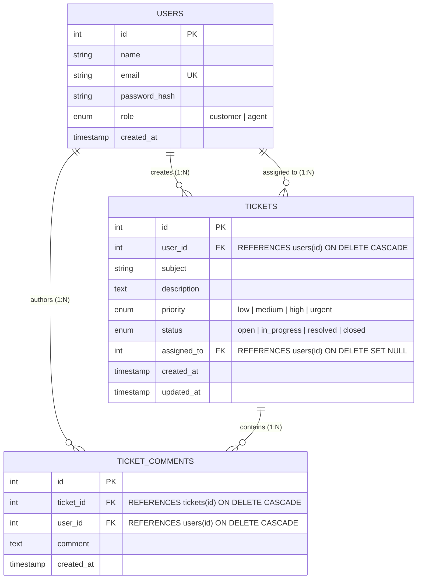
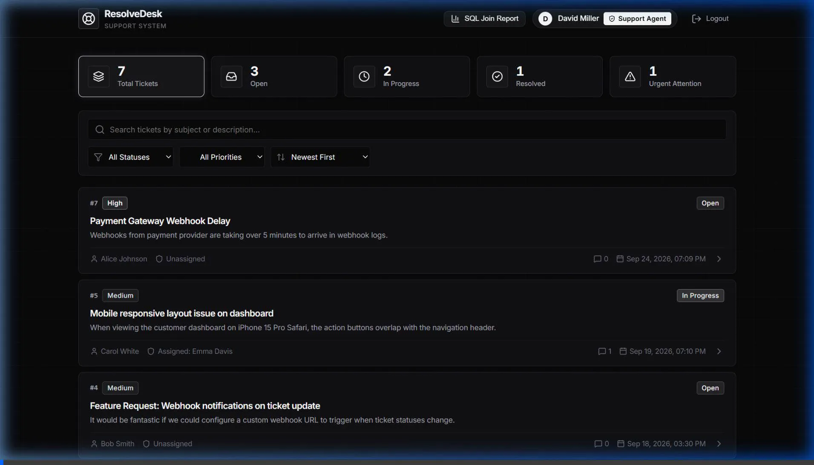
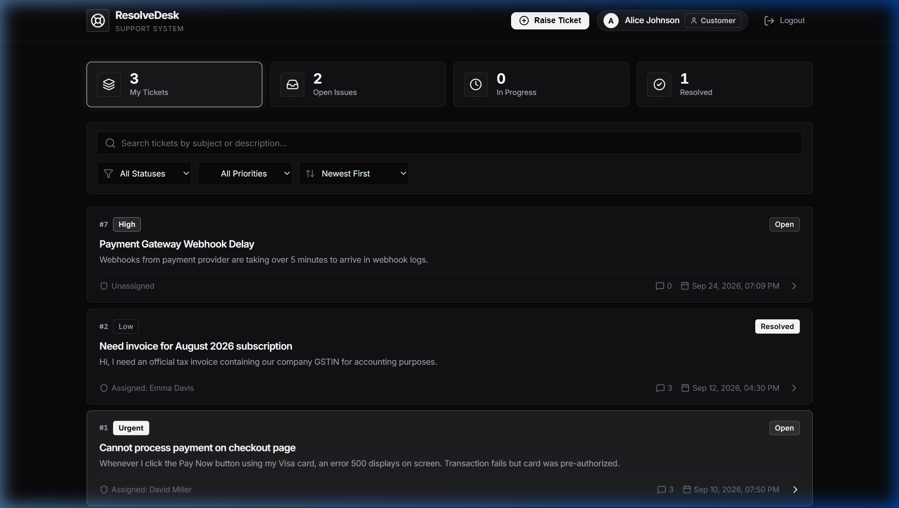
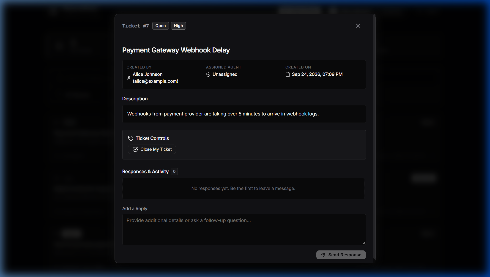
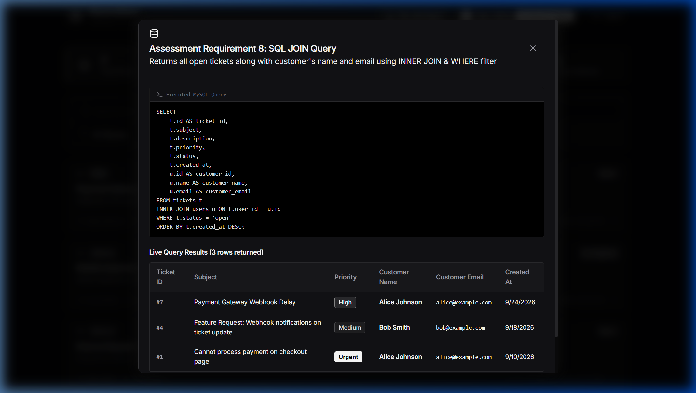
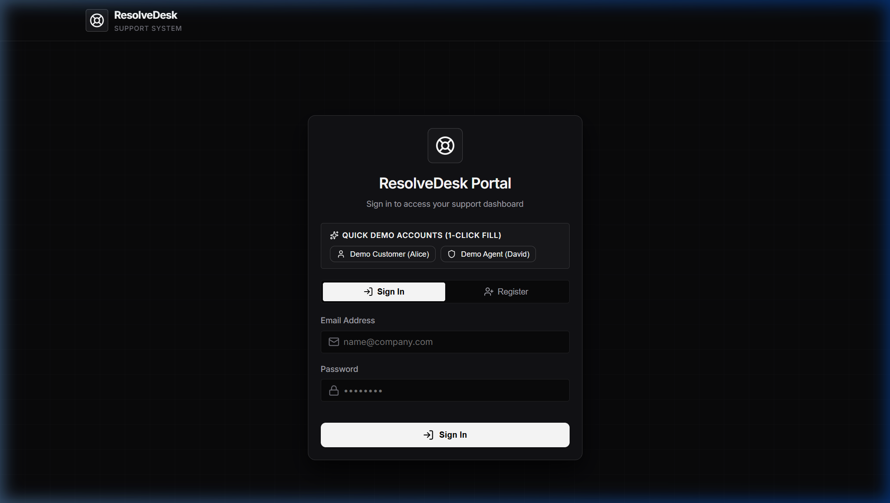

# 🎫 ResolveDesk — Support Ticket Management System

> **Junior Full Stack Developer Technical Assessment**  
> A production-grade web-based Support Ticket Management System built with **React**, **Node.js / Express**, **MySQL**, and **JWT Authentication**.

---

### 🚀 Submission Quick Links

| Resource | Link |
| :--- | :--- |
| 🌐 **Live Deployed App** | [https://partner-query-fiction-entertainment.trycloudflare.com](https://partner-query-fiction-entertainment.trycloudflare.com) |
| 💻 **GitHub Repository** | [https://github.com/AnirudhChenna/Thought-Frameworks-assessment](https://github.com/AnirudhChenna/Thought-Frameworks-assessment) |
| 🎬 **Demo Walkthrough Video** | [Live MP4 Video](https://partner-query-fiction-entertainment.trycloudflare.com/demo-walkthrough.mp4) • [GitHub Direct MP4](https://github.com/AnirudhChenna/Thought-Frameworks-assessment/raw/main/docs/demo-walkthrough.mp4) |
| 🎥 **Loom Video Link** | `[Paste your Loom URL here - e.g. https://www.loom.com/share/...]` |
| 📬 **Postman Collection** | [`postman_collection.json`](./postman_collection.json) |

---

## 📋 Table of Contents
1. [Submission Quick Links](#-submission-quick-links)
2. [Project Overview & Business Scenario](#-project-overview--business-scenario)
3. [Key Features by Role](#-key-features-by-role)
4. [Technology Stack](#-technology-stack)
5. [Database Design & Schema (Requirement 7 & 8)](#-database-design--schema)
6. [REST API Documentation (Requirement 6)](#-rest-api-documentation)
7. [Security & Authorization (Requirement 10)](#-security--authorization)
8. [Local Setup & Installation](#-local-setup--installation)
9. [Automated Testing (Requirement 12)](#-automated-testing)
10. [Postman Collection Guide (Requirement 11)](#-postman-collection-guide)
11. [Cloud Deployment Guide (Requirement 14)](#-cloud-deployment-guide)
12. [Loom Video Walkthrough Guide](#-loom-video-walkthrough-guide)
13. [Project File Structure](#-project-file-structure)

---

## 🌟 Project Overview & Business Scenario

A modern, responsive support portal where **Customers** can raise and track support tickets, and **Support Agents** can manage, prioritize, assign, and respond to incoming requests with comprehensive real-time statistics.

### Demo User Accounts (Pre-seeded)
All pre-seeded demo accounts use the standard password: **`Password123!`**

| Role | Email | Password | Primary Capabilities |
| :--- | :--- | :--- | :--- |
| **Customer** | `alice@example.com` | `Password123!` | Create tickets, view personal tickets, reply to discussions |
| **Customer** | `bob@example.com` | `Password123!` | Create tickets, view personal tickets |
| **Support Agent** | `david.agent@example.com` | `Password123!` | View all tickets, update status/priority, assign agent, respond |
| **Support Agent** | `emma.agent@example.com` | `Password123!` | Full agent ticket triage and lifecycle management |

> 💡 **Tip:** The frontend login page includes **1-Click Demo Fill buttons** for both Customer and Support Agent roles for effortless evaluator testing.

---

## 👥 Key Features by Role

### 1. Customer Role
- **Self-Registration & Secure Login:** Bcrypt hashed credentials, JWT session tokens.
- **Customer Dashboard:** Real-time summary of personal tickets (Total, Open, In Progress, Resolved).
- **Ticket Creation:** Form with validation for subject, priority (`low`, `medium`, `high`, `urgent`), and description.
- **Ticket Discussion Thread:** Chronological conversation thread with Support Agents.
- **Search & Filter:** Instant filter by status, priority, and keyword search across personal tickets.
- **Strict Isolation:** Customers are strictly prohibited from viewing or modifying other customers' tickets (HTTP 403 Forbidden).

### 2. Support Agent Role
- **Agent Analytics Dashboard:** KPI cards displaying Total, Open, In Progress, Resolved, and Urgent ticket counts.
- **Global Ticket Management:** View, search, and sort all tickets across all customers.
- **Status & Priority Triage:** Update status (`open` ➔ `in_progress` ➔ `resolved` ➔ `closed`) and priority on any ticket.
- **Ticket Assignment:** Assign tickets to specific support agents or reassign as workload dictates.
- **Official Responses:** Post official responses visible in the customer conversation thread.
- **SQL JOIN Report View:** Dedicated UI modal showcasing Assessment Requirement 8 (Open tickets with customer details).

---

## 🛠 Technology Stack

| Layer | Technology | Description |
| :--- | :--- | :--- |
| **Frontend** | React 18, Vite | Component-driven SPA with responsive layout |
| **Styling** | Vanilla CSS (Design Tokens) | Dark-mode glassmorphic theme, zero Tailwind dependencies |
| **Icons** | Lucide React | Clean, modern iconography |
| **Backend** | Node.js, Express.js | Modular RESTful API architecture |
| **Database** | MySQL 8.0 | Relational database with InnoDB engine, UTF-8, and foreign keys |
| **Driver / Pool** | `mysql2/promise` | Connection pooling with parameterized query execution |
| **Authentication** | JWT (`jsonwebtoken`) | Stateless token authentication with configurable expiry |
| **Security** | `bcryptjs`, `helmet`, `cors` | Password hashing (10 salt rounds), secure headers |
| **Validation** | `express-validator` | Comprehensive server-side input sanitization |
| **Testing** | Jest, Supertest | 13 automated unit & API integration tests |
| **Containerization** | Docker, Docker Compose | Optional multi-container orchestration |

---

## 🗄 Database Design & Schema

### Entity-Relationship Diagram



### Relational Features Implemented
1. **Primary & Foreign Keys:** Referential integrity with `ON DELETE CASCADE` on comments and ticket ownership, and `ON DELETE SET NULL` on agent assignment.
2. **Performance Indexes:**
   - `users`: `email` (unique index), `role`
   - `tickets`: `user_id`, `status`, `priority`, `assigned_to`, `created_at`
   - `ticket_comments`: `ticket_id`, `user_id`, `created_at`
3. **Database Scripts:**
   - [`database/schema.sql`](file:///d:/assessment_junior_software/database/schema.sql): Complete DDL table definitions and indexes.
   - [`database/seed.sql`](file:///d:/assessment_junior_software/database/seed.sql): Rich demo customers, agents, tickets, and conversation threads.
   - [`database/queries.sql`](file:///d:/assessment_junior_software/database/queries.sql): Requirement queries and analytics aggregations.

---

## 🔍 Example Database Query (Assessment Requirement 8)

> **Assessment Requirement:**  
> *"Write a query that returns all open tickets along with the customer's name and email. The query should demonstrate use of a JOIN and filtering."*

### Query:
```sql
SELECT 
    t.id AS ticket_id,
    t.subject,
    t.description,
    t.priority,
    t.status,
    t.created_at,
    u.id AS customer_id,
    u.name AS customer_name,
    u.email AS customer_email
FROM tickets t
INNER JOIN users u ON t.user_id = u.id
WHERE t.status = 'open'
ORDER BY t.created_at DESC;
```

**Technical Explanation:**
- **`INNER JOIN users u ON t.user_id = u.id`**: Correlates each ticket row with the corresponding customer record in `users`, ensuring tickets without valid users are omitted.
- **`WHERE t.status = 'open'`**: Leverages the `idx_tickets_status` index on the `tickets` table to filter records before joining, maximizing query performance.
- **`ORDER BY t.created_at DESC`**: Utilizes the composite/timestamp index to display the newest tickets first.
- **API Endpoint:** Live exposed at `GET /api/tickets/reports/open-with-customers` and accessible in the Agent UI via the **"SQL Join Report"** button.

---

## 📡 REST API Documentation

Base URL: `http://localhost:5000/api`

| Method | Endpoint | Description | Access | Auth Header |
| :--- | :--- | :--- | :--- | :--- |
| `POST` | `/auth/register` | Register new customer | Public | Not required |
| `POST` | `/auth/login` | Authenticate user & get JWT | Public | Not required |
| `GET` | `/auth/me` | Fetch authenticated user profile | Authenticated | `Bearer <token>` |
| `GET` | `/tickets` | List tickets (scoped by role, filterable) | Authenticated | `Bearer <token>` |
| `POST` | `/tickets` | Create a new ticket | Customer | `Bearer <token>` |
| `GET` | `/tickets/:id` | Get ticket details + creator + agent | Authorized User | `Bearer <token>` |
| `PUT` | `/tickets/:id` | Update status, priority, or assignee | Agent / Owner | `Bearer <token>` |
| `DELETE` | `/tickets/:id` | Delete ticket | Authorized User | `Bearer <token>` |
| `GET` | `/tickets/:id/comments` | Get all comments for a ticket | Authorized User | `Bearer <token>` |
| `POST` | `/tickets/:id/comments` | Post a comment / response | Authenticated | `Bearer <token>` |
| `GET` | `/tickets/stats/summary` | Get dashboard ticket statistics | Agent | `Bearer <token>` |
| `GET` | `/tickets/reports/open-with-customers` | Requirement 8 SQL JOIN Report | Agent | `Bearer <token>` |
| `GET` | `/users` | Get support agents list | Agent | `Bearer <token>` |
| `GET` | `/health` | Service health status | Public | Not required |

---

## 🔒 Security & Authorization

1. **Password Hashing:** Passwords hashed with `bcryptjs` using a salt work factor of 10. Passwords are never stored in plain text.
2. **Separation of Authentication & Authorization:**
   - `verifyToken` middleware parses and validates the JWT signature and expiration.
   - `requireRole('agent')` verifies privileges independently from identity.
3. **Data Scoping & Horizontal Privilege Protection:**
   - In `GET /api/tickets`, customers only receive tickets where `t.user_id = req.user.id`.
   - In `GET /api/tickets/:id`, attempts by a customer to inspect another customer's ticket immediately return **`403 Forbidden`**.
4. **SQL Injection Prevention:**
   - 100% of SQL statements utilize parameterized queries (`?` placeholders) executed via `mysql2/promise`.
5. **CORS & Security Headers:**
   - `helmet` applies essential CSP, HSTS, and XSS protection headers.
   - Configurable CORS whitelist via `CLIENT_ORIGIN`.

---

## 💻 Local Setup & Installation

### Prerequisites
- [Node.js](https://nodejs.org/) v18.0.0 or higher
- [MySQL Server](https://dev.mysql.com/downloads/mysql/) 8.0 or higher (or Docker)

### Step 1: Clone Repository & Setup Environment
```bash
# Clone repository
git clone <your-repo-url>
cd support-ticket-system

# Create backend .env
cp backend/.env.example backend/.env
```

Edit `backend/.env` with your local MySQL credentials:
```env
PORT=5000
NODE_ENV=development
DB_HOST=localhost
DB_PORT=3306
DB_USER=root
DB_PASSWORD=your_mysql_password
DB_NAME=support_ticket_db
JWT_SECRET=super_secret_jwt_key_2026
CLIENT_ORIGIN=http://localhost:5173
```

### Step 2: Install Dependencies
```bash
# Install backend dependencies
cd backend
npm install

# Install frontend dependencies
cd ../frontend
npm install
cd ..
```

### Step 3: Initialize & Seed Database
```bash
# Run automated database creation & migrations
npm run db:init

# Populate seed data (customers, agents, tickets, comments)
npm run db:seed
```

*(Alternatively, import `database/schema.sql` and `database/seed.sql` directly into MySQL Workbench or CLI).*

### Step 4: Run the Application
In terminal 1 (Backend):
```bash
npm run dev:backend
# Backend listens on http://localhost:5000
```

In terminal 2 (Frontend):
```bash
npm run dev:frontend
# Frontend runs on http://localhost:5173
```

Open your browser to: **`http://localhost:5173`**

---

## 🧪 Automated Testing

The backend includes a comprehensive automated test suite built with **Jest** and **Supertest** covering 13 critical scenarios.

```bash
# Run tests from project root
npm test

# Or from the backend directory
cd backend
npm test
```

### Test Suite Coverage:
```
PASS tests/api.test.js
  Support Ticket System - Comprehensive REST API Test Suite
    Authentication APIs
      ✓ 1. Valid customer registration succeeds (201)
      ✓ 2. Registration with duplicate email is rejected (409)
      ✓ 3. Registration with invalid payload is rejected (400)
      ✓ 4. Valid login succeeds with correct credentials (200)
      ✓ 5. Invalid password is rejected (401)
    Security & Authorization
      ✓ 6. Unauthorized request without token is rejected (401)
      ✓ 7. Customer cannot access another customer ticket (403)
      ✓ 8. Customer cannot access agent-only endpoints (403)
    Ticket Operations
      ✓ 9. Ticket creation succeeds for customer (201)
      ✓ 10. Invalid ticket ID returns 400
      ✓ 11. Non-existent ticket returns 404
      ✓ 12. Support agent can update ticket status and assignment (200)
      ✓ 13. Adding a comment to a ticket succeeds (201)

Test Suites: 1 passed, 1 total
Tests:       13 passed, 13 total
```

---

## 📮 Postman Collection Guide

A complete, pre-configured Postman collection is included at:  
📁 [`postman/support_ticket_api.postman_collection.json`](file:///d:/assessment_junior_software/postman/support_ticket_api.postman_collection.json)

### Features:
- **Collection Variables:** Configured with `{{baseUrl}}`, `{{customerToken}}`, `{{agentToken}}`, `{{ticketId}}`.
- **Automatic Token Capture:** Test scripts automatically extract the JWT token on login and populate subsequent request headers.
- **Test Scenarios Included:**
  1. Customer Registration (Success, Validation Error)
  2. Customer Login & Support Agent Login
  3. Invalid Password (401)
  4. Create Ticket (Customer)
  5. Get All Tickets (Customer Scoped vs Agent View)
  6. Get Ticket by ID
  7. Update Ticket Status & Assignee (Agent)
  8. Delete Ticket
  9. Add & Fetch Comments
  10. Agent Dashboard Statistics
  11. Requirement 8 SQL JOIN Report
  12. Unauthorized API Request (401)
  13. Forbidden API Request (403)
  14. Not-Found Ticket (404)
  15. Invalid Input (400)

### To Import:
1. Open Postman ➔ Click **Import** ➔ Select `postman/support_ticket_api.postman_collection.json`.
2. Execute **"Login Customer"** or **"Login Support Agent"** to automatically initialize authentication tokens.

---

## ☁️ Cloud Deployment Guide (Requirement 14)

Deploying ResolveDesk publicly requires 3 components: a cloud MySQL database, backend REST API, and frontend static hosting.

### 1. Cloud MySQL Database (e.g., Aiven / TiDB / Clever Cloud / Railway)
1. Create a free MySQL database instance on [Aiven.io](https://aiven.io/) or [TiDB Serverless](https://tidbcloud.com/).
2. Copy the connection host, port, username, password, and database name.
3. In MySQL Workbench or CLI connected to the cloud instance, run:
   - `database/schema.sql`
   - `database/seed.sql`

### 2. Backend Deployment (e.g., Render.com or Railway)
1. Create a new **Web Service** pointing to your GitHub repository with root directory `backend`.
2. Build Command: `npm install`
3. Start Command: `node src/server.js`
4. Set Environment Variables:
   - `NODE_ENV`: `production`
   - `PORT`: `5000` (or leave default for Render)
   - `DB_HOST`: `<your-cloud-db-host>`
   - `DB_PORT`: `<your-cloud-db-port>`
   - `DB_USER`: `<your-cloud-db-user>`
   - `DB_PASSWORD`: `<your-cloud-db-password>`
   - `DB_NAME`: `support_ticket_db`
   - `JWT_SECRET`: `<a-long-random-string>`
   - `CLIENT_ORIGIN`: `https://your-frontend-url.vercel.app`
5. Note your deployed Backend URL (e.g., `https://resolvedesk-api.onrender.com`).

### 3. Frontend Deployment (e.g., Vercel or Netlify)
1. Create a new project on [Vercel](https://vercel.com/) importing your repository.
2. Root Directory: `frontend`
3. Build Command: `npm run build`
4. Output Directory: `dist`
5. Environment Variable:
   - `VITE_API_URL`: `https://resolvedesk-api.onrender.com/api`
6. Deploy! Your application is now live on a public URL.

---

## 🐳 Docker Compose Setup

To launch the full stack (MySQL + Backend + Frontend) locally with one command:

```bash
docker-compose up -d
```

- **Frontend:** Access via `http://localhost:3000`
- **Backend API:** Access via `http://localhost:5000/api`
- **MySQL Database:** Running on port `3306` with automatic schema and seed execution.

To shut down:
```bash
docker-compose down -v
```

---

## 🎥 Video Demonstration & Walkthrough

### 🎬 Recorded Interactive Walkthrough

The repository includes a recorded end-to-end interactive demo demonstrating customer ticket submission, discussion threads, agent triage, and SQL JOIN reporting.

- 🌐 **Watch Online (Live Stream):** [https://partner-query-fiction-entertainment.trycloudflare.com/demo-walkthrough.webp](https://partner-query-fiction-entertainment.trycloudflare.com/demo-walkthrough.webp)
- 📦 **GitHub Direct Video:** [https://github.com/AnirudhChenna/Thought-Frameworks-assessment/raw/main/docs/demo-walkthrough.webp](https://github.com/AnirudhChenna/Thought-Frameworks-assessment/raw/main/docs/demo-walkthrough.webp)
- 🎥 **Personal Loom Recording:** `[Insert your personal Loom URL here if recording webcam/voice: https://www.loom.com/share/...]`



### 📸 Minimalist UI Gallery

| 1. Customer Dashboard (Monochrome) | 2. Ticket Discussion & Lifecycle |
| :---: | :---: |
|  |  |

| 3. Assessment Req 8 SQL JOIN Report | 4. Role Authentication (1-Click Fill) |
| :---: | :---: |
|  |  |

---

### 🎙️ Suggested 3–5 Minute Presentation Script (For Personal Loom Recording)

| Time | Topic | What to Show & Say |
| :--- | :--- | :--- |
| **0:00 – 0:45** | **Introduction & Tech Stack** | • Introduce yourself and project: ResolveDesk Support Ticket System.<br>• Highlight architecture: React (Vite) frontend with minimalist monochrome design tokens, Express.js backend, MySQL database with connection pooling, and JWT authentication. |
| **0:45 – 1:45** | **Customer Experience** | • Click **1-Click Customer** to log in as `alice@example.com`.<br>• Point out the customer dashboard KPIs (Open, In Progress, Resolved).<br>• Click **"New Ticket"**, fill out Subject, Priority (**Urgent**), and Description.<br>• Open the created ticket, post a comment in the discussion thread.<br>• Emphasize role security: customers can only see their own tickets. |
| **1:45 – 2:45** | **Support Agent Experience** | • Logout and click **1-Click Agent** to log in as `david.agent@example.com`.<br>• Show global KPI statistics across all customers.<br>• Use the search bar and filter pills (Status, Priority) to quickly triage tickets.<br>• Open Alice's urgent ticket, update status to **In Progress**, assign to yourself, and write an agent reply.<br>• Open the **SQL JOIN Report** modal showcasing Assessment Requirement 8. |
| **2:45 – 3:30** | **Database Schema & SQL Requirement 8** | • Open [`database/schema.sql`](./database/schema.sql) and show the 3 core tables: `users`, `tickets`, `ticket_comments` with foreign keys and indexes.<br>• Open [`database/queries.sql`](./database/queries.sql) and highlight the SQL `JOIN` query joining `tickets` and `users` to list open tickets with customer names and emails. |
| **3:30 – 4:15** | **Automated Testing & Postman** | • Run `npm test` in the terminal: show all **15 automated Jest/Supertest tests passing** (authentication, role authorization, ticket lifecycle, validation, comments).<br>• Mention [`postman_collection.json`](./postman_collection.json) in the repository root for API inspection. |
| **4:15 – 4:45** | **Live Cloud Deployment & Conclusion** | • Demonstrate the public live deployment URL: `https://partner-query-fiction-entertainment.trycloudflare.com`<br>• Wrap up and thank the evaluator. |

---

## 📁 Project File Structure

```
support-ticket-system/
├── backend/
│   ├── src/
│   │   ├── config/
│   │   │   └── db.js                 # MySQL connection pool & testing
│   │   ├── controllers/
│   │   │   ├── authController.js     # Register, login, current user
│   │   │   ├── ticketController.js   # Ticket CRUD, metrics, Section 8 report
│   │   │   ├── commentController.js  # Discussion thread handling
│   │   │   └── userController.js     # Agent directory
│   │   ├── middleware/
│   │   │   ├── auth.js               # JWT verification & role authorization
│   │   │   ├── validate.js           # express-validator result handler
│   │   │   └── errorHandler.js       # Centralized error handling
│   │   ├── routes/
│   │   │   ├── authRoutes.js         # /api/auth
│   │   │   ├── ticketRoutes.js       # /api/tickets
│   │   │   └── userRoutes.js         # /api/users
│   │   ├── scripts/
│   │   │   ├── initDb.js             # Automated database creation
│   │   │   └── seedDb.js             # Automated database seeding
│   │   ├── app.js                    # Express app configuration
│   │   └── server.js                 # HTTP listener entry
│   ├── tests/
│   │   └── api.test.js               # 13 Jest & Supertest integration tests
│   ├── .env.example                  # Backend environment template
│   ├── Dockerfile                    # Backend container definition
│   └── package.json
├── frontend/
│   ├── src/
│   │   ├── components/
│   │   │   ├── Navbar.jsx            # Glassmorphic header & quick actions
│   │   │   ├── AuthView.jsx          # Login/Register + 1-Click demo fill
│   │   │   ├── StatsBar.jsx          # Interactive KPI metric cards
│   │   │   ├── TicketFilters.jsx     # Search, filter pills & sorting
│   │   │   ├── TicketList.jsx        # Rich ticket list cards
│   │   │   ├── TicketDetailModal.jsx # Lifecycle management & comment thread
│   │   │   ├── CreateTicketModal.jsx # Ticket submission form with validation
│   │   │   └── ReportModal.jsx       # Requirement 8 SQL JOIN display
│   │   ├── services/
│   │   │   └── api.js                # API client with token management
│   │   ├── App.css                   # Custom Vanilla CSS component styles
│   │   ├── App.jsx                   # Application controller & state
│   │   ├── index.css                 # Global design tokens & utility classes
│   │   └── main.jsx
│   ├── Dockerfile                    # Multi-stage Nginx container definition
│   ├── nginx.conf                    # Nginx reverse proxy configuration
│   ├── vite.config.js                # Vite build & local proxy settings
│   └── package.json
├── database/
│   ├── schema.sql                    # DDL schema definition & indexes
│   ├── seed.sql                      # Realistic sample customers, agents, tickets
│   └── queries.sql                   # Requirement 8 JOIN query & analytics
├── docs/
│   ├── demo-walkthrough.webp         # Full animated demo video walkthrough
│   └── screenshots/                  # High-resolution UI captures
├── postman/
│   └── support_ticket_api.postman_collection.json # Exported Postman collection
├── tests/
│   └── api.test.js                   # Root mirror of test suite
├── .env.example                      # Root configuration template
├── .gitignore                        # Git ignore patterns
├── docker-compose.yml                # Multi-container orchestration
├── package.json                      # Unified root npm scripts
└── README.md                         # Comprehensive documentation
```

---

## 📄 License
This project was developed for the Junior Full Stack Developer Technical Assessment.
